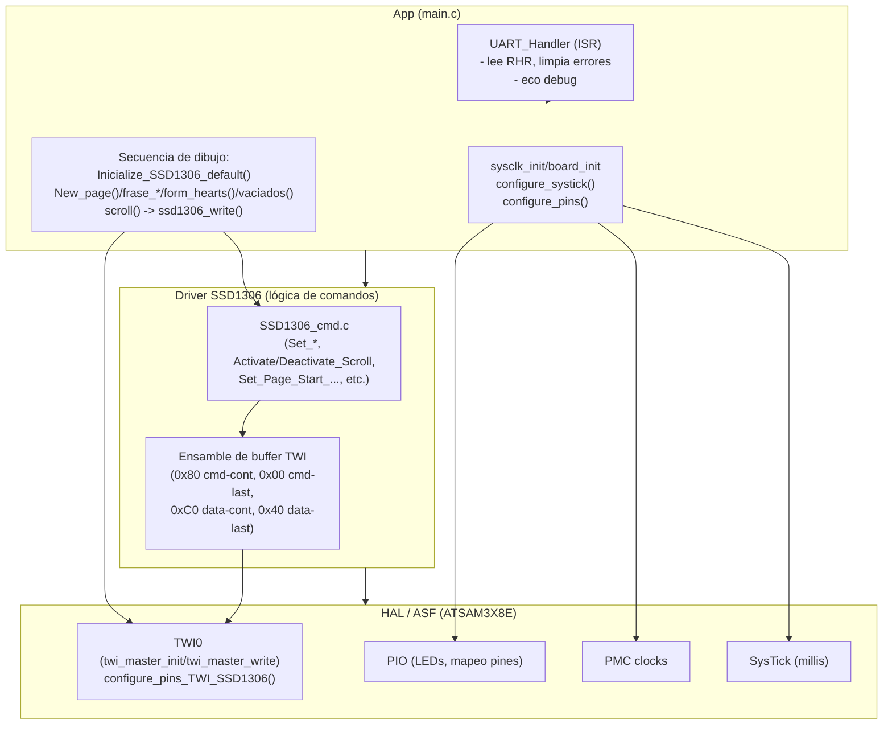
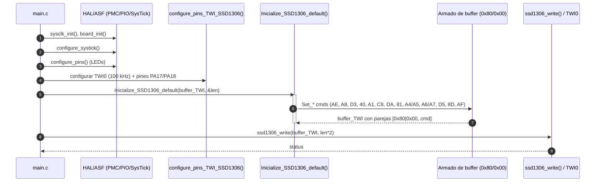

# SSD1306 – UML del flujo actual (Mermaid)
**Autor:** jose heriberto  
**Fecha:** 2025-09-14  
**Propósito:** Documentar el flujo real del proyecto (init, armado de buffers, envío I²C, texto/figuras y scroll).  
**Ámbito:** App (main.c), Driver SSD1306 (cmd/ensamble), HAL/ASF (TWI0, PIO, PMC, SysTick).  
**Refs:** `SSD1306_cmd.c`, `SSD1306.h`, `main.c`

---

## 1) Vista de componentes (capas y dependencias)


---

## 2) Secuencia – Arranque e inicialización


---

## 3) Secuencia – Renderizado por páginas (texto/figuras/limpios y scroll)
```mermaid
sequenceDiagram
  autonumber
  participant Main as main.c
  participant CMD as New_page()/frase_A/B/C()/form_hearts()/vaciados()/scroll()
  participant BUF as Armado de buffer (0x80 cmd / 0xC0 data)
  participant I2C as ssd1306_write()/TWI0

  Main->>CMD: New_page(..., PAGE_0)
  CMD->>BUF: [0x80, B0|page] ... ultimo con 0x00
  BUF-->>Main: buffer_TWI, len
  Main->>I2C: ssd1306_write()
  end

  Main->>CMD: form_hearts()
  CMD->>BUF: datos con 0xC0 (cont.) y 0x40 (ultimo)
  BUF-->>Main: buffer_TWI (len=256)
  Main->>I2C: ssd1306_write(buffer_TWI, len)


  Note over Main: Vaciar paginas 1,2,6
  loop por cada pagina {1,2,6}
    Main->>CMD: New_page(PAGE_n)
    CMD->>BUF: comando B0|page (0x80...0x00)
    Main->>I2C: ssd1306_write(cmd)

    Main->>CMD: vaciados() (datos 0x00)
    CMD->>BUF: datos 0xC0...0x40
    Main->>I2C: ssd1306_write(data)
  end
  end


  Note over Main: Frases en paginas 3,4,5
  loop frase_A/B/C
    Main->>CMD: New_page(PAGE_k)
    CMD->>BUF: B0|page (0x80...0x00)
    Main->>I2C: ssd1306_write(cmd)

    Main->>CMD: frase_X() -> memcpy glyphs (128B)
    CMD->>BUF: datos 0xC0...0x40
    Main->>I2C: ssd1306_write(data)
  end
  end

  Note over Main: Scroll horizontal
  Main->>CMD
  CMD->>BUF: 0x26/0x27 + parametros; 0x2F (activate)
  end
  BUF-->>Main: buffer_TWI cmds (0x80...0x00)
  Main->>I2C: ssd1306_write(cmds scroll)
```

---

## 4) Máquina de estados – Driver/flujo SSD1306
```mermaid
stateDiagram-v2
  [*] --> Reset

  state Reset {
    note right: HW/SW reset
  }

  Reset --> InitSequence: Inicialize_SSD1306_default()
  InitSequence --> Ready: AF (Display ON) OK
  InitSequence --> Error: NAK / timeout

  Ready --> Updating: New_page()/frase_*/form_hearts()/vaciados()\n-> ssd1306_write(data)
  Updating --> Ready: última página/último byte (0x40) OK
  Updating --> Error: NAK / write fail

  Ready --> Scrolling: scroll() -> (0x26/0x27 ... 0x2F)
  Scrolling --> Ready: Deactivate_Scroll (0x2E) o redraw
  Scrolling --> Error: NAK

  Error --> Reset: política de reintento (max N)
```

---

## 5) Actividad – Ensamblado de buffer TWI (comandos y datos)
```mermaid
flowchart LR
  A[Iniciar buffer_TWI] --> B{¿Tipo?}
  B -- Comando --> C[Escribir 0x80 (continuación)\npara todos menos el último]
  C --> D[Escribir CMD]
  D --> E{¿Último comando del bloque?}
  E -- Sí --> F[Usar 0x00 en el último CMD]
  E -- No --> B

  B -- Datos --> G[Escribir 0xC0 (continuación)\npara todos menos el último]
  G --> H[Escribir DATA]
  H --> I{¿Último dato del bloque?}
  I -- Sí --> J[Usar 0x40 en el último DATA]
  I -- No --> B
```
